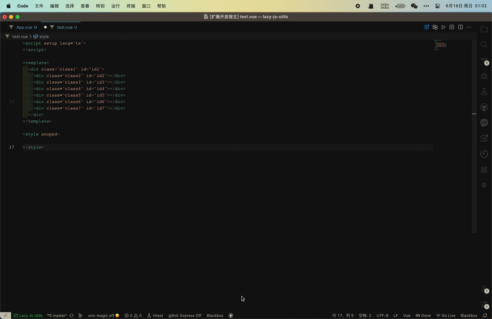

 <a href="./README.md">English</a> | 简体中文

实现一个元素选择器的效果，针对vue、svelte、react、html等等中间元素选择器,比如`#`对应提示所有的id选择器,`.`提示所有的class选择器

## :coffee:

[请我喝一杯咖啡](https://github.com/Simon-He95/sponsor)

## License

[MIT](./license)
